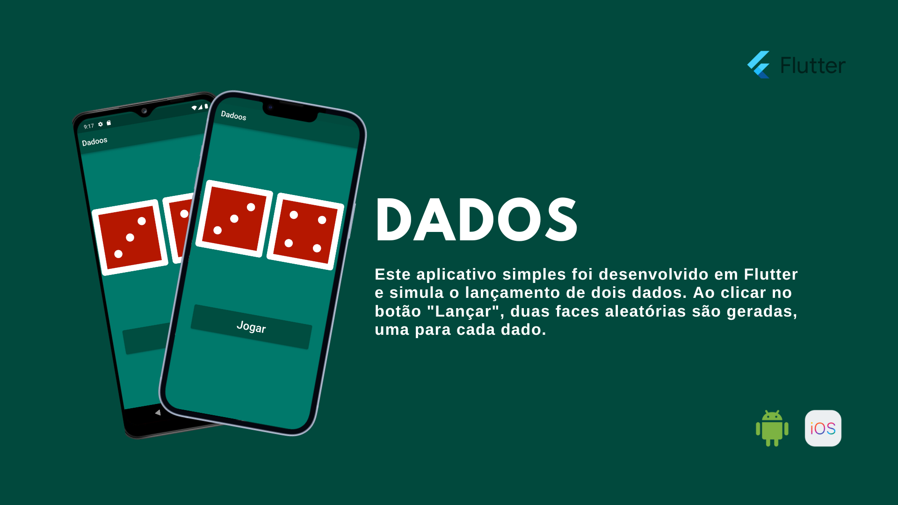

## App Flutter: Lançamento de Dados

  

**Descrição:**

Este aplicativo simples foi desenvolvido em Flutter e simula o lançamento de dois dados. Ao clicar no botão "Lançar", duas faces aleatórias são geradas, uma para cada dado.

**Funcionalidades:**

* Lançamento de dois dados virtuais.
* Geração de faces aleatórias.
* Interface simples e intuitiva.

**Requisitos:**

* Flutter SDK instalado.
* Dart SDK instalado.

**Como usar:**

1. Clone o repositório para o seu computador.
2. Abra o projeto no Android Studio ou VSCode.
3. Execute o aplicativo no emulador ou dispositivo físico.
4. Clique no botão "Lançar" para gerar novas faces.

**Tecnologias utilizadas:**

* Flutter
* Dart

**Observações:**

* Este é um aplicativo simples para fins demonstrativos.
* O código pode ser facilmente modificado para adicionar funcionalidades adicionais.

**Contribuições:**

Sinta-se à vontade para contribuir com o projeto, enviando pull requests com sugestões de melhorias ou correções de bugs.

**Licença:**

Este aplicativo está licenciado sob a licença MIT.

**Contato:**

Se você tiver alguma dúvida ou sugestão, entre em contato com o autor do projeto.

**Exemplo de uso:**

1. Abra o aplicativo.
2. Clique no botão "Lançar".
3. Observe as faces aleatórias geradas para cada dado.
4. Repita o processo quantas vezes quiser.

**Agradecimentos:**

Agradeço a todos que contribuíram para o desenvolvimento deste aplicativo.
